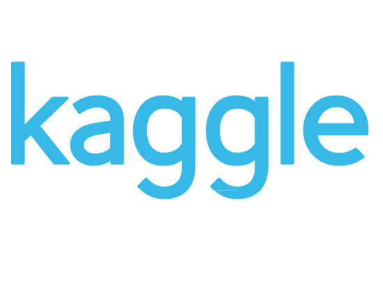

 

Wellcome to my kaggle competitions repository. In the past, I have also been contributing to [another kaggle repository](https://github.com/MLblog/jads_kaggle.git). This repository also 
contains the work of people with whom I have collaborated so far. Each folder, describes the scope of the competition, collaborators (if any) and the end solution together with the 
perfomance metrics achieved.

## Humpback Whale Identification
The scope of [this](https://www.kaggle.com/c/humpback-whale-identification) competition is to develop an algorithm that identifies individual whales in images.